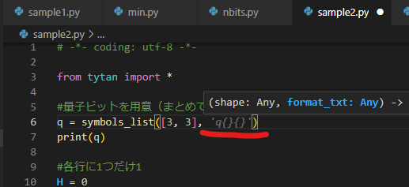

<!--
title:   TYTANのサンプルを動かす
tags:    Python,TytanSDK
id:      770b15f3e12d2965103a
private: false
-->
## 話題のTYTAN

https://github.com/tytansdk/tytan/

※この記事ではGPUは使いません

### [サンプル1](https://github.com/tytansdk/tytan/?tab=readme-ov-file#%E3%82%B5%E3%83%B3%E3%83%97%E3%83%AB%E3%82%B3%E3%83%BC%E3%83%89%EF%BC%91)


`サンプルコード１`を`sample1.py`に保存して・・・

```bash
~/tytan$ python3 sample1.py 
[{'x': 0, 'y': 1, 'z': 1}, -4.0, 22]
[{'x': 1, 'y': 0, 'z': 1}, -4.0, 25]
[{'x': 1, 'y': 1, 'z': 0}, -4.0, 53]
```

問題なし。

次に、`サンプルコード2`を`sample2.py`に保存して・・・

### [サンプル2](ttps://github.com/tytansdk/tytan/tree/main?tab=readme-ov-file#%E3%82%B5%E3%83%B3%E3%83%97%E3%83%AB%E3%82%B3%E3%83%BC%E3%83%89%EF%BC%92)

```bash
/tytan$ python3 sample2.py 
Traceback (most recent call last):
  File "/home/syasuda/tytan/sample2.py", line 6, in <module>
    q = symbols_list([3, 3])
TypeError: symbols_list() missing 1 required positional argument: 'format_txt'
```

`symbols_list()`のシグニチャが変わっているのに、サンプルが追従していないだけのことで。


というか、Copilotが（良い意味で）適当に埋めてくれる程度の問題のようです。



~~修正すると、あっさり動きます。~~

まだエラーが出ます。（出るようになっています。）

```python
syasuda@DESKTOP-ADBQ9TJ:~/tytan$ python3 sample2.py 
Traceback (most recent call last):
  File "/home/syasuda/tytan/sample2.py", line 6, in <module>
    q = symbols_list([3, 3], 'q{}{}')
  File "/home/syasuda/.local/lib/python3.10/site-packages/tytan/symbol.py", line 32, in symbols_list
    raise TytanException("separate {} in format_txt like format_txt=\'q{}_{}\'")
tytan.symbol.TytanException: separate {} in format_txt like format_txt='q{}_{}'
```

必要な修正は以下です。

```diff
- q = symbols_list([3, 3], 'q{}{}')
+ q = symbols_list([3, 3], 'q{}_{}')
```


```python
~/tytan$ python3 sample2.py 
[[q0_0 q0_1 q0_2]
 [q1_0 q1_1 q1_2]
 [q2_0 q2_1 q2_2]]
result
[{'q0_0': 0, 'q0_1': 0, 'q0_2': 1, 'q1_0': 0, 'q1_1': 1, 'q1_2': 0, 'q2_0': 1, 'q2_1': 0, 'q2_2': 0}, -6.0, 12]
[{'q0_0': 0, 'q0_1': 0, 'q0_2': 1, 'q1_0': 1, 'q1_1': 0, 'q1_2': 0, 'q2_0': 0, 'q2_1': 1, 'q2_2': 0}, -6.0, 16]
[{'q0_0': 0, 'q0_1': 1, 'q0_2': 0, 'q1_0': 0, 'q1_1': 0, 'q1_2': 1, 'q2_0': 1, 'q2_1': 0, 'q2_2': 0}, -6.0, 18]
[{'q0_0': 0, 'q0_1': 1, 'q0_2': 0, 'q1_0': 1, 'q1_1': 0, 'q1_2': 0, 'q2_0': 0, 'q2_1': 0, 'q2_2': 1}, -6.0, 27]
[{'q0_0': 1, 'q0_1': 0, 'q0_2': 0, 'q1_0': 0, 'q1_1': 0, 'q1_2': 1, 'q2_0': 0, 'q2_1': 1, 'q2_2': 0}, -6.0, 12]
[{'q0_0': 1, 'q0_1': 0, 'q0_2': 0, 'q1_0': 0, 'q1_1': 1, 'q1_2': 0, 'q2_0': 0, 'q2_1': 0, 'q2_2': 1}, -6.0, 15]
get_ndarray
[[0 0 1]
 [0 1 0]
 [1 0 0]]
[['0', '1', '2'], ['0', '1', '2']]
get_dframe
   0  1  2
0  0  0  1
1  0  1  0
2  1  0  0
get_image
```

だれかfolkしてprを投げてください。（定型文）

## 追記

ドキュメントには、`symbol_list()`の第2引数が省略できない旨の記述がありました。
https://github.com/tytansdk/tytan/blob/main/document%20.md?plain=1#L37

```
文字シンボルを配列に定義する場合、次のようにndarray配列を得ます。
第2引数は省略できません！（2024/02/18修正より）
```

ただ、[チュートリアル](https://github.com/tytansdk/tytan_tutorial?tab=readme-ov-file)を上からたどると、サンプル２が先に来てしまうんですよね。

```
TYTANの基本的な使い方はこちら → TYTANトップページ ★ここにサンプル2がある
TYTANの本格的な使い方はこちら → TYTANドキュメント ★ここに注意書きがある
・・・
```
